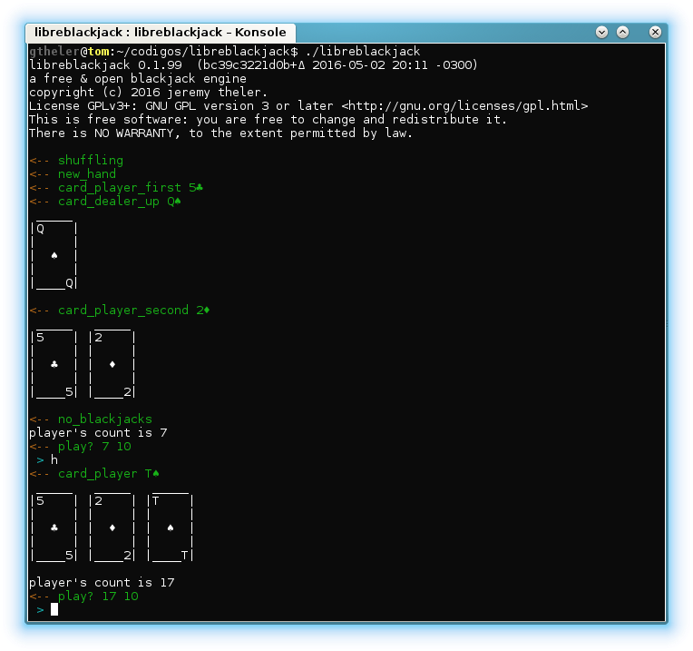

# Overview

LibreBlackjack is a blackjack engine that emulates a dealer, deals (digital) cards and understands plain-text commands such as `hit` or `stand`. The basic idea is that one or more players can talk to LibreBlackjack either in an interactive or in an automated way through
 
 * the standard input and/or output,
 * named pipes,
 * POSIX message queues,
 * TCP (web)sockets (using `netcat` or `gwsocket`), or
 * dynamically loaded arbitrary routines from shared objects.
  
These players can be actual human players playing in real-time through a front end (a GUI application, a web-based interface, a mobile app, etc.) or robots that implement a certain betting and playing strategy playing (i.e. card counting) as fast as possible to study and analyze game statistics. There is an internal player that reads the strategy from a text file and plays accordingly. It can also be used to play interactive ASCII blackjack.

{width=50%}


# Running `libreblackjack`

## Invocation

```
Usage: ./libreblackjack [options] [path_to_conf_file]
a free & open blackjack engine

If no configuration file is given, a file named blackjack.conf
in the current directory is used, provided it exists.
See the full documentation for the available options and the default values.

  -h, --hands=N    set the number of hands to play before quiting
  -d, --decks=N    set the number of decks to use
  -f, --flatbet    do not ask for the bet before each hand, use a unit flat bet
  -i, --internal   use the internal player to play agains the dealer (not interactive)

  -h, --help       display this help and exit
  -v  --version    output version information and exit
```

## Interactive game

## Automated playing


# Commands


# Configuration file


# Example automated players


